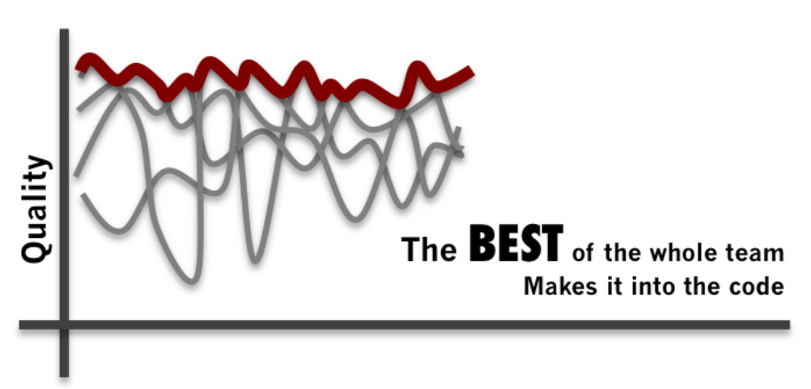
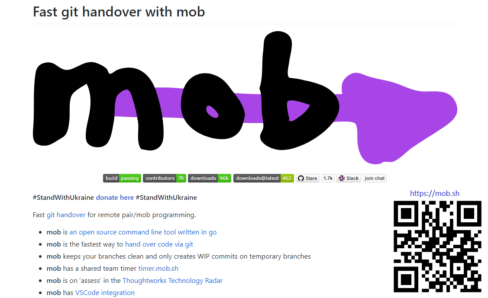

---

# Wiio's Law

Communication usually fails, except by accident.

-- <cite>Osmo Antero Wiio</cite>

---

# Wiio's Law

### If a message can be interpreted in several ways, it will be interpreted in a manner that maximizes the damage.

---

---

### Collaboration > Communication

---

## Mob Programming
aka **Ensemble Programming**,

or **Advanced Software Teaming**

---

Mob Programming is all about working well together as a team.

###  Actually together. 

---

### A meeting where the minutes are code

- in the same space 
- at the same time 
- on the same code 
- on the same screen 
- solving the same problem

---

### A deliberate practice

- Strong style (dedicated typist/talker)
- Rotate frequently
- Safe space
- Regular retrospectives
- Continuous improvement

---

### Benefits

- We learn from each other.
- We enjoy ourselves.
- We identify and correct mistakes early.

---

<small>- Maaret Pyhäjärvi & Llewellyn Falco (2018) Mob Programming Guidebook</small>

---

### Timelapse of a day in a company dedicated to Mob Programming

<video controls src="day-of-mob-programming.mp4"></video>

-- <cite>https://www.youtube.com/watch?v=dVqUcNKVbYg</cite>

---

### Remote Mob Programming Timelapse

<video controls src="remote-mob-programming-timelapse.mp4"></video>

-- <cite>https://www.youtube.com/watch?v=SQLECiZBnc0</cite>

---

---

# mob.sh Demo

---

### Where to try mob programming

- Join my Thursdays mob
    - https://github.com/gregorriegler/mob-programming-rpg
- Global Day of Coderetreat (coming up)
- Weekly ApprovalTests Mob
    - https://github.com/approvals/ApprovalTests.Python

---

## Gregor Riegler

- Principal Software Engineer at Tricentis
- Maintainer of mob.sh
- Technical Coach at the Samman Society
- Software-Crafters Vienna
- gregorriegler.com
- www.linkedin.com/in/gregorriegler
- mobsh.slack.com
